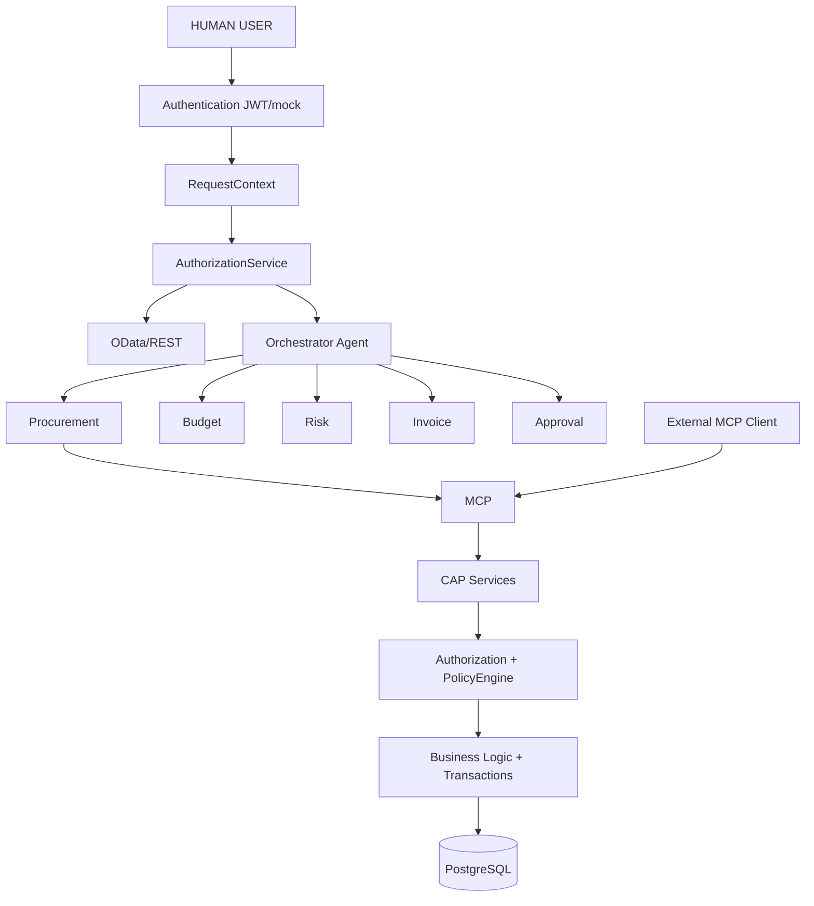
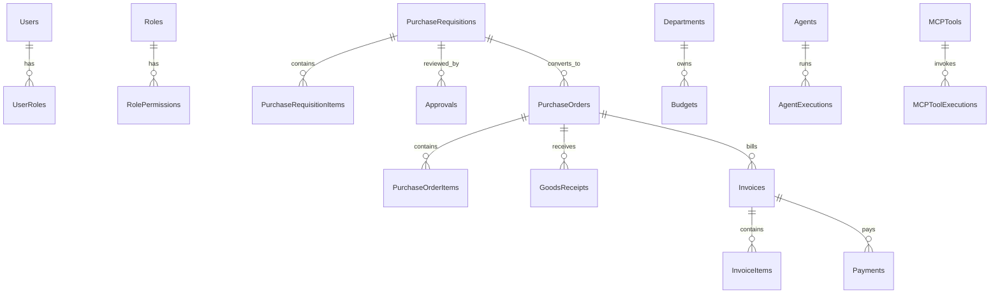
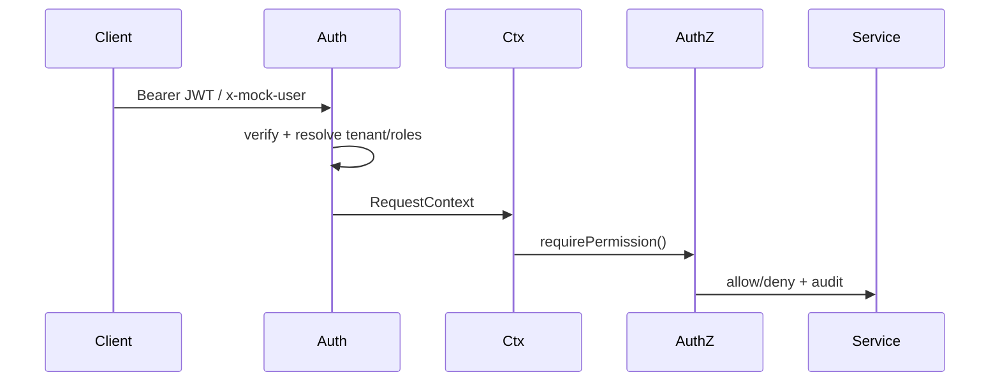
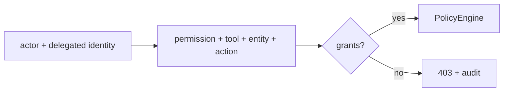
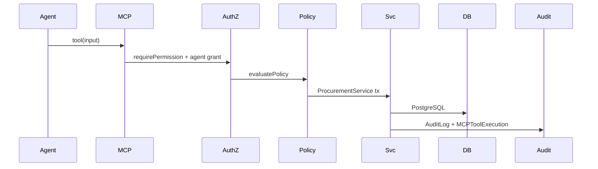
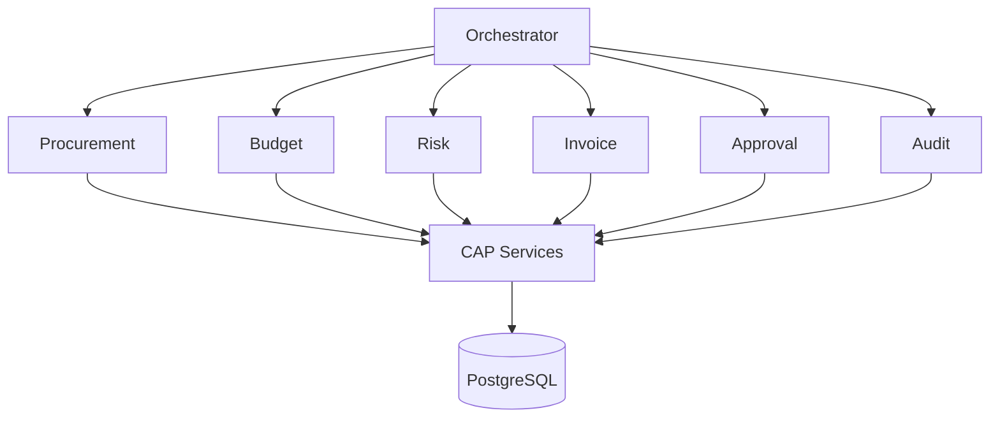
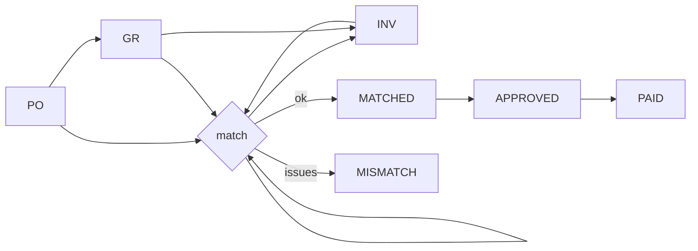
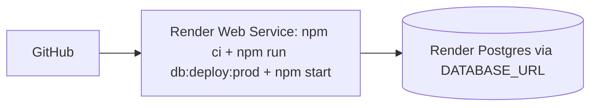
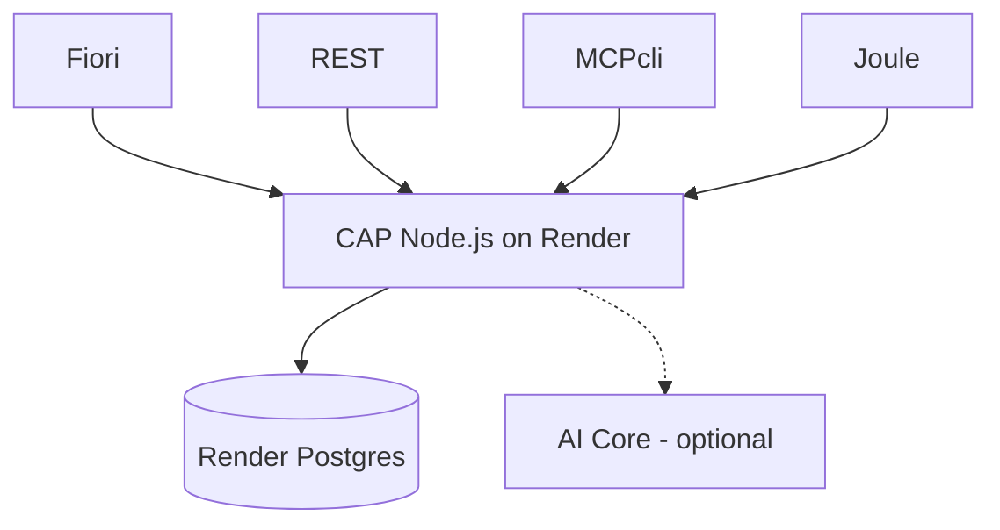

# enterprise-ai-procurement

Production-grade **SAP CAP (Node.js + TypeScript + PostgreSQL)** backend for enterprise procurement,
with **RBAC, tenant isolation, audit logging, workflow, MCP tools, A2A agents, policy engine,
and AI security controls**. Consumed safely by Fiori/UI5, REST clients, MCP clients, and AI agents —
all through the same authorization model.

Verified versions (Sep 2026): `@sap/cds` **10.0.6**, `cds-dk` **10.0.7**, `@cap-js/postgres` **3.0.1**,
`@cap-js/mcp` **1.4.3**, `@cap-js/agents` **0.9.3** (alpha), `@cap-js/cds-test` **1.0**, Node **20+** (dev on 24).

## Contents
- [Architecture](#architecture) · [Folder structure](#folder-structure) · [Domain](#domain-model)
- [Auth & RBAC](#authentication--authorization--rbac) · [Tenancy](#multi-tenancy)
- [MCP](#mcp-runtime-business-interface) · [A2A agents](#a2a-agents) · [Policy](#policy-engine--human-in-the-loop)
- [AI security](#ai-security) · [Workflow](#business-workflow) · [Audit](#audit-logging)
- [Local dev](#local-development) · [PostgreSQL](#postgresql) · [Render](#render-deployment)
- [Testing](#testing) · [API examples](#example-api-calls) · [MCP tools](#mcp-tool-list) · [Agents](#agent-list)
- [Env vars](#environment-variables) · [Limitations](#known-limitations)

## Architecture


## Folder structure
```
enterprise-ai-procurement/
  db/{common.cds,schema.cds,data/*.csv}
  srv/{procurement,approval,supplier,invoice,catalog,agent,mcp,audit}-service.{cds,ts} server.ts
  lib/{auth,authorization,agents,mcp,audit,security,workflow,validation,database}
  test/{security.test.ts,unit.test.ts}
  Dockerfile docker-compose.yml .cdsrc.json cds.env .env.example README.md AGENTS.md
```

## Domain model
Users/Roles/Permissions/UserRoles/RolePermissions · Organizations/Departments/Employees ·
Suppliers/Contacts/Materials/Categories · PurchaseRequisitions/Items · Approvals/Steps ·
PurchaseOrders/Items · GoodsReceipts/Items · Invoices/Items · Payments · Budgets/Consumptions ·
Workflows/Tasks · Notifications · AuditLogs · Agents/Permissions/ToolPermissions/Executions ·
MCPTools/Executions · AIConversations/Messages · RiskAssessments · Policies/Violations.
See `db/schema.cds`; ER overview:


## Authentication / Authorization / RBAC
- `lib/auth/authentication.ts`: extracts `Bearer` JWT (XSUAA/IAS claims: `sub`, `zid`, `roles`/`scope`,
  `agentId`), else safe mock via `x-mock-user` / `x-agent-id` (local only, `ALLOW_MOCK_AUTH`).
  Builds `RequestContext { userId, tenantId, roles, permissions, isAgent, agentId, actorType, correlationId }`.
- `lib/authorization/authorization.ts`: `hasRole/hasPermission/require*`, `canExecuteTool`, `enforceTenant`.
- Roles: ADMIN, PROCUREMENT_MANAGER, PROCUREMENT_OFFICER, APPROVER, FINANCE, SUPPLIER_MANAGER, AUDITOR, EMPLOYEE, AI_AGENT (empty by default).
- 21 permissions (see `lib/auth/rbac.ts`). Enforcement is **server-side in handlers**, never frontend.



## Multi-tenancy
Every tenant-sensitive entity carries `tenantId` (from auth context). Handlers add
`req.query.where({ tenantId })` and overwrite `req.data.tenantId`. `enforceTenant()` rejects
forged `?tenantId=OTHER`. Mock tenants: `tenant-a` (Acme IN), `tenant-b` (Acme EU).

## MCP (runtime business interface)
Plugin `@cap-js/mcp`; service annotated `@mcp` (`srv/mcp-service.cds`). This is **just another
protocol** (like OData/REST): `npm add @cap-js/mcp` → annotate → served at `/mcp/*`.
Distinct from `@cap-js/mcp-server` (dev-time coding assistant). Flow per tool call:
identity → authZ → tenant → policy → validation → business service → tx → audit → response.


## A2A agents
`@cap-js/agents` (alpha), `AgentService` annotated `@Agent`. Specialists call CAP services only:

Orchestrator flow for "Create PO for PR-1001": authenticate → load PR → status==APPROVED? →
`CREATE_PURCHASE_ORDER`? → budget → supplier → risk → policy → human needed? → create PO in tx → audit.

## Policy engine / human-in-the-loop
`Policies` entity + `lib/workflow/policy.ts`. Defaults: `< ₹50k` AUTO_APPROVE ·
`₹50k–500k` REQUIRE_MANAGER · `₹500k–1M` REQUIRE_HUMAN · `> ₹1M` mandatory human ·
HIGH/CRITICAL risk always human. **LLM recommends; policy decides.**

## AI security
- LLM never authorizes: `LLM → tool request → AuthorizationService → PolicyEngine → service → DB`.
- `sanitizeForLLM` strips "ignore previous instructions" patterns; business data treated as DATA.
- AI outputs re-validated (CDS validation + authZ + policy + DB state) before execution.
- `AIService` abstraction (`lib/agents/ai-service.ts`): mock locally, SAP AI Core/GenAI Hub when `AI_API_URL/KEY` set.
- Rate limiting per tool+actor; secrets masked in logs; no passwords/tokens logged.

## Business workflow
PR: DRAFT→SUBMITTED→UNDER_REVIEW→APPROVED→CONVERTED_TO_PO (REJECTED→DRAFT re-open only, CANCELLED terminal).
PO: DRAFT→PENDING_APPROVAL→APPROVED→SENT_TO_SUPPLIER→PARTIALLY/FULLY_RECEIVED→INVOICED→CLOSED.
Illegal transitions rejected (`INVALID_STATE_TRANSITION`). Concurrent approvals use `SELECT … FOR UPDATE` + version check.
```mermaid
stateDiagram-v2
  [*] --> DRAFT: PR
  DRAFT --> SUBMITTED --> UNDER_REVIEW --> APPROVED --> CONVERTED_TO_PO
  UNDER_REVIEW --> REJECTED --> DRAFT
```
Invoice three-way match (PO + GoodsReceipt + Invoice): price/quantity/supplier/duplicate/GR checks.


## Audit logging
`AuditLogs { timestamp, tenantId, actorType(USER/AGENT/SYSTEM), actorId, userId, agentId, delegatedUserId,
action, entity, entityId, old/new, result, correlationId, requestId, ip }`.
Actions: `PURCHASE_REQUISITION_*`, `PURCHASE_ORDER_CREATED/CANCELLED`, `MCP_TOOL_EXECUTED`,
`AGENT_ACTION_EXECUTED`, `INVOICE_APPROVED`, `PAYMENT_CREATED`. Plus `AgentExecutions` and `MCPToolExecutions`.

## Observability
Structured JSON logs with request/correlation/tenant/actor IDs; health endpoints (no secrets).

## Local development
```bash
npm i                            # also installs global `cds` CLI prerequisite? see below
npm i -g @sap/cds-dk             # CAP tooling (one-time)
# .env controls the switch: CDS_ENV=postgres -> Render PG; commented out -> SQLite
npm run db:deploy:local            # schema to local PG via docker (local cds-deploy binary)
npm start                          # production-equivalent start: tsx + CDS_TYPESCRIPT, :4004
# or: npm run watch                # dev with live reload (cds watch)
curl localhost:4004/health
# OData with mock user:
curl -H "x-mock-user: procurement@example.com" localhost:4004/odata/v4/procurement/PurchaseRequisitions
# Agent call:
curl -H "x-mock-user: manager@example.com" -H "x-agent-id: agent-orchestrator" localhost:4004/.well-known/agent.json
```
Mock users: `admin/employee/approver/procurement/manager/finance/auditor@example.com`, `other-tenant@example.com`, agent via `x-agent-id`.

### Option A — throwaway SQLite (default)
Do nothing: without `CDS_ENV`, the app uses in-memory SQLite. Every boot reseeds demo data.

### Option B — local testing against Render Postgres (persistent)
Secrets live ONLY in gitignored files (never committed — verified by secret scan):
- `.env` — app vars: `PORT`, `CDS_ENV=postgres` (the switch), `JWT_SECRET`, `ALLOW_MOCK_AUTH=true` for dummy users.
- `default-env.json` — `VCAP_SERVICES` entry with the Render host/user/password (external hostname for local dev; SSL on).
```bash
npm run db:deploy:pg   # schema + seeds -> Render (scripts/deploy-pg.cjs)
npm start              # reads .env -> CDS_ENV=postgres -> Render PG, mock users active
# flip back to SQLite anytime: comment out CDS_ENV in .env and restart
```
All 18 live E2E checks pass identically on SQLite and Render Postgres with the dummy users.

## PostgreSQL
Via `@cap-js/postgres`. Credentials resolve from `VCAP_SERVICES` (Cloud Foundry) or `default-env.json` locally (same shape) — see Option B above. Dev defaults to in-memory SQLite (`.cdsrc.json`); `[production]` and `[postgres]` profiles select Postgres. Never commit `.env` / `default-env.json`.
Cross-database lessons baked in: direct `INSERT`s carry explicit `randomUUID()` IDs and re-read the row (PG returns `[]`, SQLite returns the object); pool timeouts raised for cloud latency; `SELECT.one` everywhere for single rows.

## Render deployment

1. Create Render **PostgreSQL**, copy Internal `DATABASE_URL`.
2. Create **Web Service** (this repo, Docker or Node): build `npm ci`, start `npm run db:deploy:prod || true; npm start` (see `Dockerfile`).
3. Env: `DATABASE_URL`, `JWT_SECRET`, `JWT_ISSUER/AUDIENCE`, `ALLOW_MOCK_AUTH=false`, `AI_*` (optional), `PORT` (auto).
4. Verify `/health`, `/readiness`.

## SAP BTP (Cloud Foundry via MTA)
`mta.yaml` + `xs-security.json` + `approuter/` (`package.json`, `xs-app.json`) deploy the backend, approuter (XSUAA login, `/health` open, APIs authenticated), XSUAA roles/scopes (mirrors `lib/auth/rbac.ts` 1:1 — 9 roles, 21 scopes, 9 role collections), and PostgreSQL:
```bash
mbt build && cf deploy mta_archives/enterprise-ai-procurement_1.0.0.mtar
cf run-task procurement-backend "npm run db:deploy:prod"   # one-time schema deploy
cf set-env procurement-backend JWT_SECRET <random-secret> && cf restage procurement-backend
```
Assign role collections (e.g. `EnterpriseAIProcurement_Approver`) in the BTP cockpit. Authentication on BTP is fully wired: approuter enforces XSUAA login and forwards the user JWT; the backend validates it via `@sap/xssec` (JWKS), takes the tenant from the XSUAA subdomain, and maps token scopes 1:1 to app permissions/roles (`lib/auth/authentication.ts`: `permissionsFromScopes`/`deriveRolesFromScopes`, unit-tested). No code changes needed between local mock, Render HS256, and BTP XSUAA — the same `RequestContext` flows everywhere.

## Testing
```bash
npm test   # vitest: RBAC, tenant isolation, workflow, policy, 3-way match, injection, rate-limit, errors
```
Covers: auth/RBAC, tenant forgery, PR approve/reject rules, PO creation gates, budget/supplier validation,
invoice matching, MCP + agent authZ (+ unauthorized denial), policy incl. human-approval gate, audit write,
illegal transitions, concurrent-approval versioning, prompt-injection sanitization, AI output validation.

## Example API calls
```bash
GET /odata/v4/procurement/PurchaseRequisitions?$filter=status eq 'APPROVED'&$top=10
POST /odata/v4/procurement/PurchaseRequisitions {...}                       # x-mock-user: employee@example.com
POST /odata/v4/procurement/submitRequisition {"ID":"..."}
POST /odata/v4/procurement/approveRequisition {"ID":"...","comment":"ok"}   # APPROVER only
POST /odata/v4/procurement/convertToPurchaseOrder {"requisitionID":"...","supplierID":"..."}
POST /odata/v4/invoices/matchInvoice {"invoiceID":"..."}
GET /health /readiness /liveness   GET /.well-known/agent.json
```

## MCP tool list
`searchPurchaseRequisitions`, `getPurchaseRequisition`, `createPurchaseRequisition`,
`searchPurchaseOrders`, `getPurchaseOrder`, `createPurchaseOrder`, `searchSuppliers`, `getSupplier`,
`checkBudget`, `getInvoiceStatus`, `getApprovalStatus`, `getProcurementRisk`, `submitForApproval` —
each with description, schemas, required permission, allowed roles, 20–60/min limit, audit.

The MCP (Streamable HTTP) endpoint is served by `@cap-js/mcp` at:

```
POST http://localhost:4004/mcp/procurement
```

Connect it to OpenCode (`opencode.json`; server must be running). Local mock auth
uses the `x-mock-user` header — pick a user whose role carries `EXECUTE_MCP_TOOL`
(e.g. `procurement@example.com`); every tool call still enforces RBAC, tenant
isolation, policy and audit. In production use a real JWT (`Authorization: Bearer …`)
with `ALLOW_MOCK_AUTH=false` and set `oauth: false`:

```json
{
  "$schema": "https://opencode.ai/config.json",
  "mcp": {
    "procurement": {
      "type": "remote",
      "url": "http://localhost:4004/mcp/procurement",
      "headers": { "x-mock-user": "procurement@example.com" },
      "oauth": false,
      "enabled": true
    }
  }
}
```

Verify with `opencode mcp list` / `opencode mcp debug procurement`, then prompt with
`use the procurement tool`.

## Agent list
Procurement (analyze/dedupe/create PO) · Approval (review/escalate, no autonomous high-value approval) ·
Supplier Risk (`riskScore/Level/reasons/recommendation`) · Invoice (3-way match) · Budget
(available/committed/remaining) · Audit (read-only) · Orchestrator (intent→specialists→policy→PO/audit).

## Environment variables
`PORT DATABASE_URL DB_HOST DB_PORT DB_NAME DB_USER DB_PASSWORD JWT_SECRET JWT_ISSUER JWT_AUDIENCE
ALLOW_MOCK_AUTH AI_API_URL AI_API_KEY AI_MODEL AI_PROVIDER` — see `.env.example`.

## Deployment architecture


## Known limitations
- `@cap-js/agents` is alpha: A2A JSON-RPC transport is minimal; full Joule handshake needs BTP bindings.
- Rate limiting is in-memory (use Redis for multi-instance).
- Mock auth is local-only; production requires real XSUAA/IAS JWTs (`ALLOW_MOCK_AUTH=false`).
- AI service uses mock responses unless AI Core credentials are wired via `@sap-ai-sdk/*`.
- Seed CSVs cover core demo flows; full PO/receipt/invoice chains are created via API in tests/demos.
```
